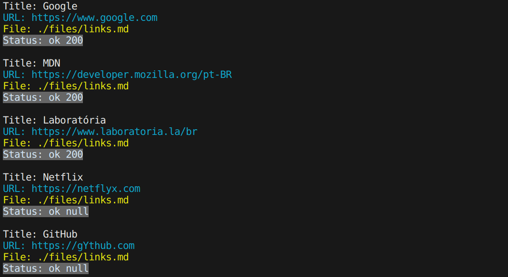
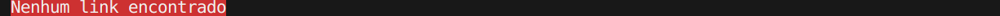
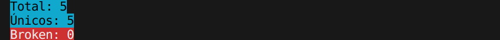
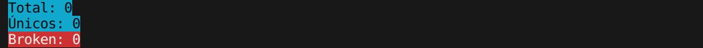

## Projeto MD-Links 

Quarto projeto desenvolvido para o bootcamp da [@Laboratória](https://www.laboratoria.la/br) O projeto Markdown Links tem como foco BackEnd (NodeJS e JavaScript) e identifica links em arquivos markdown e seus respectivos status https. Pode ser executado através de CLI.

## Índice

* [1. Prefácio](#1-prefacio) 
* [2. Fluxograma](#2-fluxograma) 
* [3. Instalação](#3-Instalação) 
* [4. Terminal e seus comandos](#4-Terminal-e-seus-comandos)
* [5. Testes](#5-testes) 
* [6. Checklists de Objetivos Alcançados](#6-checklist-de-objetivos-alcançados)
* [7. Tecnologias](#7-tecnologias)
* [8. Desenvolvido por](#8-desenvolvido)

***

## Prefácio

Markdown é usada em muitas plataformas que manipulam texto (GitHub, fórum, blogs e etc) e é muito comum encontrar arquivos com este formato em qualquer repositório (começando pelo tradicional README.md). Os arquivos Markdown normalmente contém links que podem estar quebrados, ou que já não são válidos, prejudicando muito o valor da informação que está ali.

Nesse projeto, criou-se uma ferramenta, usando Node.js, que le e analise arquivos no formato Markdown, para verificar os arquivos que contenham links e mostrar algumas estatísticas. Neste projeto, foi criado uma ferramenta de linha de comando (CLI) assim como a sua própria biblioteca (library) em Javascript usando o Node.js.

## Fluxograma 

.png)

## Instalação

## Terminal e seus comandos

- Comando validate:

md-links ./files/links.md --validate

- Comando stats:

md-links ./files/links.md --stats

## Testes

## Checklists de Objetivos Alcançados 

- [:star2:] Possui CLI.
- [:star2:] É instalável.
- [:star2:] Passa pelo linter.
- [:star2:] Passa pelos testes (npm test).
- [:star2:] Inclui fluxograma de estudos e tomada de decisões no README.md.
- [:star2:] Inclui uma definição de produto clara e informativa no README.md.
- [:star2:] Testes unitários cobrem um mínimo de 70% de statements, functions, lines e branches.
- [:star2:] Package.json: deve possuir nome, versão, descrição, autor, licença, dependências e scripts (pretest, test e etc).

***

## 7. Tecnologias

 
   
   
   
  
  
  
  
   
   
  
  ***

  ## 8. Desenvolvido por

  
   
    ALÊ RIBEIRO   
  [Linkedin](https://www.linkedin.com/in/alessandra.ribeiro)
  [Github](https://github.com/ribeirober1208)
   
   
  

 
  ***